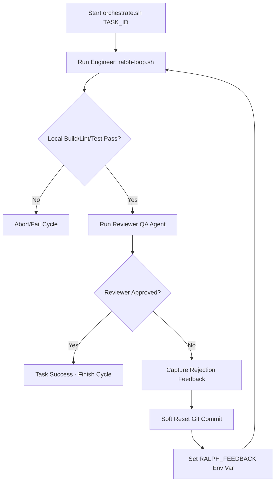

# Design Spec — QA Gate Orchestration for University Games API

**Author:** Antigravity (Google DeepMind)  
**Date:** 2026-08-02  
**Status:** Approved by User  

---

## 1. Context & Motivation

We are implementing the backend API for a University Games Competition Management System based on a database schema (`schema.prisma`) and product requirements (`PRD-api-sistema-competicoes.md`).

To prevent code degradation, architectural drifts, and technical debt during automated task execution (via the `ralph-loop.sh` framework), we need to enforce a Quality Gate. This gate acts as a **Senior Software Architect / QA Reviewer**, validating every code change against strict engineering criteria:
1. **SOLID:** Checking for SRP (Single Responsibility Principle) and OCP (Open/Closed Principle) violations.
2. **DRY:** Identifying repetitive code and recommending extraction.
3. **Documentation:** Ensuring complex functions have clear explanatory docstrings.

---

## 2. Architecture & Design

We employ a multi-agent orchestration pipeline consisting of two main roles:
1. **Engineer (Developer):** Implemented by the existing `ralph-loop.sh`, which selects the next priority task and edits code until local checks (build, lint, test) pass.
2. **Reviewer (Senior Architect / QA):** A specialized LLM agent invoked dynamically with a prompt detailing the quality rules and the exact code differences (`git diff`).

The workflow is managed by a top-level orchestrator script, `orchestrate.sh`.



---

## 3. Component Details

### 3.1. Ralph Loop Integration (`ralph-loop.sh`)
The `ralph-loop.sh` script is modified to dynamically inject reviewer comments from the previous cycle into the prompt if the `RALPH_FEEDBACK` environment variable is set.

**Change in `build_prompt` function:**
```bash
build_prompt() {
  local prompt
  prompt="$(cat "$PROMPT_FILE")"
  
  if [[ -n "$TASK_FILTER" ]]; then
    prompt="${prompt}

FOCO OBRIGATÓRIO DESTA ITERAÇÃO: trabalhe exclusivamente em ${TASK_FILTER}, ignore a ordem padrão de tasks.md se ela mandar outra coisa."
  fi

  if [[ -n "${RALPH_FEEDBACK:-}" ]]; then
    prompt="${prompt}

======================================================================
ATENÇÃO: O REVIEWER DE QA REJEITOU A TENTATIVA ANTERIOR DA TASK.
VOCÊ DEVE CORRIGIR OS MOTIVOS ABAIXO ANTES DE DECLARAR A TASK CONCLUÍDA:
${RALPH_FEEDBACK}
======================================================================"
  fi

  printf '%s' "$prompt"
}
```

### 3.2. Orchestrator Script (`orchestrate.sh`)
The `orchestrate.sh` orchestrator drives the development cycle. It:
1. Feeds the `RALPH_FEEDBACK` environment variable into the Ralph loop execution.
2. Runs the QA Reviewer against the changes committed in the last local git commit (obtained via `git diff HEAD~1 HEAD`).
3. Formats the Reviewer's output to look for the strict approval signature:
   * **Approved:** `STATUS: APROVADO`
   * **Rejected:** `STATUS: REJEITADO. Motivo: [explicações em lista]`
4. Performs a soft reset (`git reset --soft HEAD~1`) on rejection so the working tree changes are preserved, allowing the Engineer to resume editing from the exact failure point.

---

## 4. Testing & Verification

To verify that the orchestration is working correctly:
1. **Successful Path:** An engineer modifies a file cleanly, the reviewer approves it with `STATUS: APROVADO`, and the script exits successfully with code 0.
2. **Rejection Path:** An engineer introduces a DRY/SOLID violation, the reviewer outputs `STATUS: REJEITADO`, the orchestrator soft-resets the commit, sets the env variable, and prompts the engineer with the specific failure details.
3. **Robustness Check:** The orchestrator correctly escapes shell characters and multi-line strings when transferring reviewer comments to `RALPH_FEEDBACK`.
